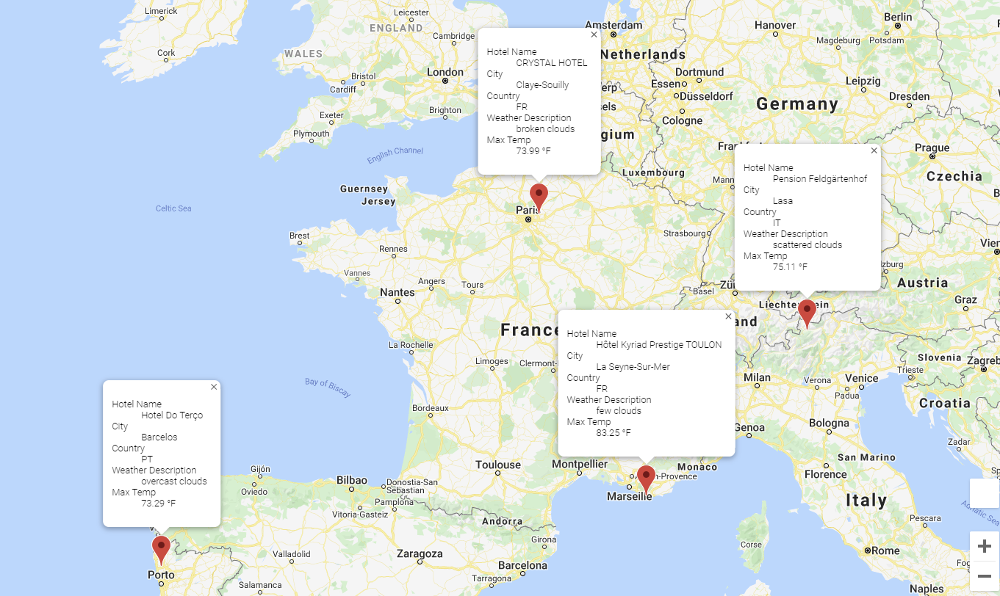

# World Weather Analysis

## Overview 
### Purpose of Project
The purpose of this project was to collect and analyze weather data across cities worldwide.  The data would then be used to recommend ideal hotels based on a client's ideal weather profile.  In addition, the data should also inform the client of possible travel itineraries based on nearby cities with the desired temperature parameters.

### Resources
- Data Sources: OpenWeather API Key, Google API Key
- Software: Python 3.8.8, Jupyter notebook 6.4.0, Jupyter lab 3.0.16
- Python libraries: numpy, pandas, matplotlib, gmaps, citipy

## Weather Analysis Summary

### Using API Keys
For this project, I registered for two API Keys (OpenWeather and Google).  Then I randomly generated 2000 latitude and longitude values and used citipy to find cities located at those geolocations.  Of the values, only roughly 750 cities were found due to so many falling on bodies of water.

After creating the cities, I used the OpenWeather API Key to pull current weather data for each of the cities and used the Google API Key to create heatmaps of the different weather data points, as well as create marker maps with pop-out boxes containing each city's information to visualize the weather and travel data. 

Finally, I wrote code that will create a Vacation Itinerary, with driving map, of four close-by cities that satisfied a set of weather parameters, such as the one below.

### Jupyter Notebook Files

The three main deliverables for this project are as follows (with links):

- Weather Database containing 700+ unique cities worldwide:
- [Database Jupyter Notebook](Weather_Database/Weather_Database.ipynb)
- Vacation Search database and map containing cities meeting temperature parameters:
- [Vacation Search Jupyter Notebook](Vacation_Search/Vacation_Search.ipynb)
- Vacation Itinerary with driving map for four nearby cities meeting temperature parameters:
- [Vacation Itinerary Jupyter Notebook](Vacation_Itinerary/Vacation_Itinerary.ipynb)
